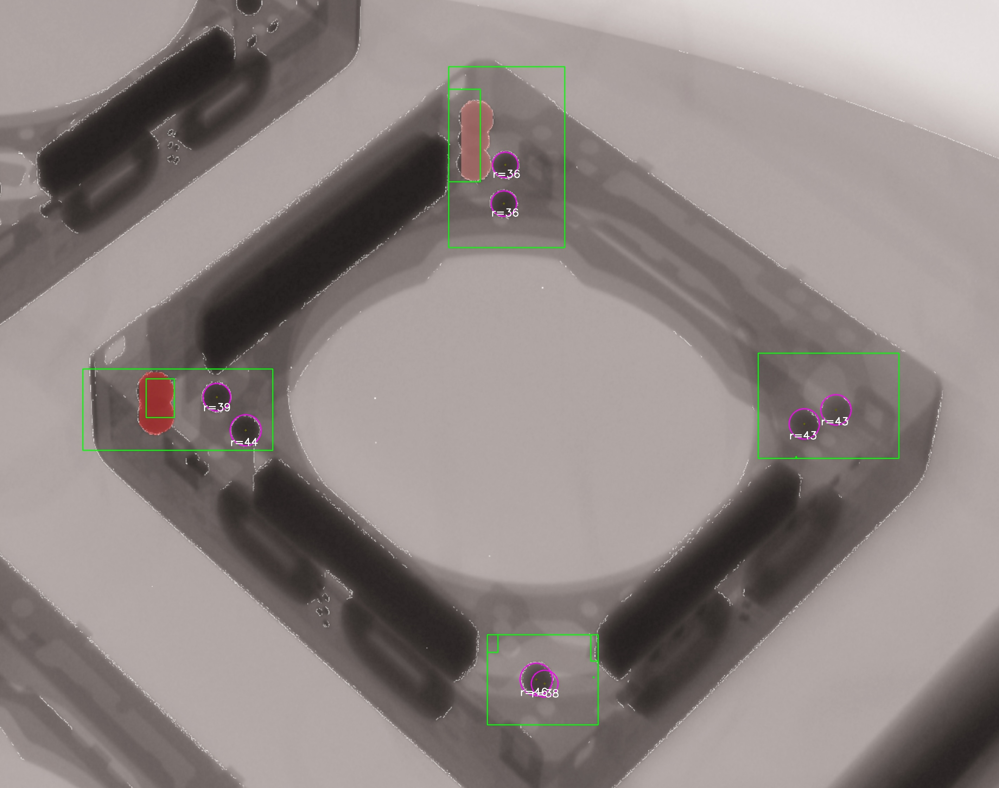

# 반도체 부품 볼 탐지

컴퓨터 비전을 활용한 실시간 반도체 부품 (볼) 탐지

## 사용 기술
YOLO, Ultralytics, 
Light enhancement, edge enhancement,
scale invariance, Translation Invariance, 
Object segmentation, edge detection, color pruning, cluster filtering...


### 실행 결과


## 설치
```bash
pip install ultralytics
